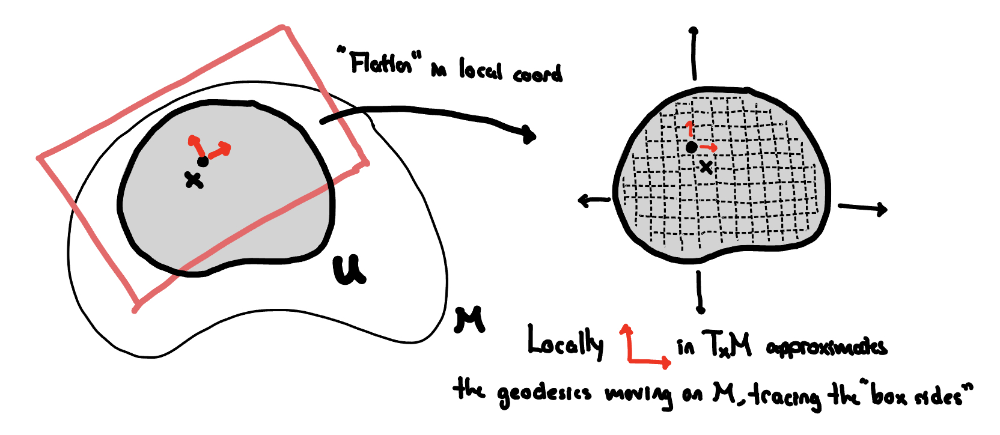

::: {.abstract-container}
[ABSTRACT]{.abstract-header}
In order to define the Laplacian on Riemannian manifold $(M,g)$, one needs to define the space it acts on. This post defines the Riemannian volume form, and the $L^2$ space of functions (and more general $k$-forms) on Riemannian manifolds. This will allow for the development of the Laplacian operator in this more general setting in later posts.
:::

**Setting.** Let $(M, g)$ be a Riemannian manifold of dimension $n$ with metric tensor $g$. The metric induces an inner product on the tangent space $T_{x}M$ at each point $x \in M$, denoted by $g(v,w)$ for vectors $v,w \in T_{x}M$. 

In the Euclidean case, the Laplacian operator $\Delta$ is defined on function $f \in L^{2}(\mathbb{R}^{n})$ by the operation 

$$\Delta  = -\operatorname{div} \circ \nabla.$$ 

To generalize this to Riemannian manifolds, we first need to define the corresponding $L^{2}$ space for functions and more generally for $k$-forms.

**Definition 1.** Let $(M, g)$ be a Riemannian manifold of dimension $n$. The $L^{2}$ space of functions on $M$ is defined as the completion of $C_{c}^{\infty}(M)$ (the space of smooth functions with compact support) with respect to the inner product

$$\langle f, g \rangle = \int_{M} f(x) g(x) \, dV_{g}(x),$$

where $dV_{g}$ is the Riemannian volume form induced by the metric $g$.

Functions are $0$-forms. Through the musical isomorphism, we can extend this definition to $k$-forms.

**Definition 2.** Let $(M, g)$ be a Riemannian manifold of dimension $n$. The $L^{2}$ space of $k$-forms on $M$ is defined as the completion of $C_{c}^{\infty}(M, \Lambda^{k}T^{*}M)$ (the space of smooth $k$-forms with compact support) with respect to the inner product

$$\langle \omega, \eta \rangle = \int_{M} g(\omega(x), \eta(x)) \, dV_{g}(x),$$

where $g(\omega, \eta)$ is the inner product on the space of $k$-forms (with abuse of notation) induced by the metric $g$. 

***Intuition.*** The inner product on $0$-forms globalize the pointwise overlap (their product) of functions by integrating against the Riemannian volume form. This aggregates the pointwise overlap over the entire manifold. This is the same idea as the $L^{2}$ space of functions on Euclidean space where implicitly we use the standard Euclidean volume form. 

More generally, for $k$-forms, the pointwise inner product $g(\omega, \eta)$ measures how much the two $k$-forms overlap at each point, and integrating this against the Riemannian volume form aggregates this overlap over the entire manifold. The generalizes the same underlying idea: the angle between globally defined objects (functions or $k$-forms) is measured by aggregating their pointwise overlap across the manifold.

## Volume Forms 
The Riemannian volume measure is defined by the following.

**Definition 3.** Let $(M, g)$ be a Riemannian manifold of dimension $n$. The Riemannian volume form $dV_{g}$ is defined as

$$dV_{g} = \sqrt{| \det(g) |} \, dx^{1} \wedge dx^{2} \wedge \cdots \wedge dx^{n},$$

where $g$ is the matrix where $g_{ij}$ are the components of the metric tensor in local coordinates $(\partial_{x^{1}}, \partial_{x^{2}}, \ldots, \partial_{x^{n}})$ where positively oriented basis of $T_{x}M$. 

Under this formula, the volume of $(M,g)$ is given by

$$\operatorname{Vol}(M) = \int_{M} dV_{g}(x).$$

To see where this formula comes from, we consider recovering the volume of a set $U \subset M$ by summing up volumes of infinitessimal boxes within the tangent spaces $T_{x}M$ for $x \in U$. This recovers the familiar idea for the Euclidean setting, where the volume of a set $U \subset \mathbb{R}^{n}$ is given by summing up volumes of infinitessimal boxes aligned with the standard basis vectors. 

We have the following picture in mind:

### (Heuristic) Derivation
Consider a positively oriented coordinate neighborhood $U \subset M$ around $x$ with coordinates $(x^{1}, x^{2}, \ldots, x^{n})$. Then pick a large number of points $\{p_{j}\}_{j=1}^{N}$ in $U$. For each point $p_{j}$, define the infinitessimal box $B_{j} \subset T_{p_{j}}M$ with sides $(\Delta x^{1})\partial_{x^{1}}, (\Delta x^{2}) \partial_{x^{2}}, \ldots, (\Delta x^{n}) \partial_{x^{n}}$ where $\Delta x^{i}$ are small increments on the $i$-th local coordinate direction $\partial_{x^{i}} = \frac{\partial}{\partial x^{i}}$. For each tangent space $T_{p_{j}}M$, let $v_1, v_2, \ldots, v_n$ be the positively oriented orthonormal basis. Then, under Einstein summation notation, we can write

$$\partial_{x^{i}} = \alpha_{i}^{k} v_{k},$$

for some matrix $\alpha^{k}_{i}$. Note that by convention, this means $\alpha_{i}^{k} v_{k} \equiv \sum_{k=1}^{n} \alpha_{i}^{k} v_{k}$. 

We expect the volume to be 

$$\begin{aligned}
\operatorname{Vol}(U) & = \lim_{\Delta x^{i} \to 0} \lim_{N \to \infty} \sum_{j=1}^{N} \operatorname{Vol}(B_{j}) \\
& = \lim_{\Delta x^{i} \to 0} \lim_{N \to \infty} \sum_{j=1}^{N} \text{Volume of Parallelepiped with $i$th Side } (\Delta {x^{i}}) \sum_{k=1}^{n} \alpha_{i}^{k}v_{k}\\
& = \lim_{\Delta x^{i} \to 0} \lim_{N \to \infty} \sum_{j=1}^{N} \left( \prod_{i=1}^{n} \Delta x^{i} \right) \left| \det(\alpha_{i}^{k}) \right| \\
& = \int_{U} \left| \det(\alpha_{i}^{k}) \right| dx^{1} \wedge dx^{2} \wedge \cdots \wedge dx^{n}
\end{aligned}$$

where $\det(\alpha)$ is the absolute value of the determinant of the matrix with entries $\alpha_{i}^{k}$. Note that in the second line we do not use the summation convention for $i$. 

By definition of the metric tensor $g$, we have that 

$$ 
g_{ij} = g(\partial_{x^{i}}, \partial_{x^{j}}) = g(\alpha_{i}^{k} v_{k}, \alpha_{j}^{\ell} v_{\ell}) = \alpha_{i}^{k} \alpha_{j}^{\ell} g(v_{k}, v_{\ell}) = \alpha_{i}^{k} \alpha_{j}^{\ell} \delta_{k \ell} = \alpha_{i}^{k} \alpha_{j}^{k} = (AA^{T})_{ij},
$$

where $A = (\alpha_{i}^{j})$. Thus, it follows that 

$$\det(g) = \det(AA^{T}) = \det(A)^{2},$$

and so we have that the volume form of $U$ should be given by

$$
\operatorname{Vol}(U) = \int_{U} \sqrt{|\det(g)|} \, dx^{1} \wedge dx^{2} \wedge \cdots \wedge dx^{n}.
$$

This derivation is heuristic, but it provides the intuition for why the Riemannian volume form takes the form it does.

***Exercise.*** Verify that the volume form is a well-defined $n$-form on $M$; that is, it does not depend on the choice of the positively oriented coordinate chart.

## $L^{2}$ Spaces on Riemannian Manifolds
With the Riemannian volume form defined, we can now define the desired $L^{2}$ spaces. The first definition for functions is natural, as it generalizes the Euclidean $L^{2}$ space by replacing the standard volume form with the Riemannian volume form. The second definition for $k$-forms uses the inner product on $k$-forms induced by the metric tensor $g$. 

The rest of this section is devoted to recalling the definition of $k$-forms, and understanding the induced inner product from the metric tensor. By abuse of notation, we will denote the inner product on $k$-forms induced by $g$ also by $g(\cdot, \cdot)$.

### Review of $k$-Forms

### Metric Tensor on $1$-Forms

### Metric Tensor on $2$-Forms

### General $k$-Form Intuition